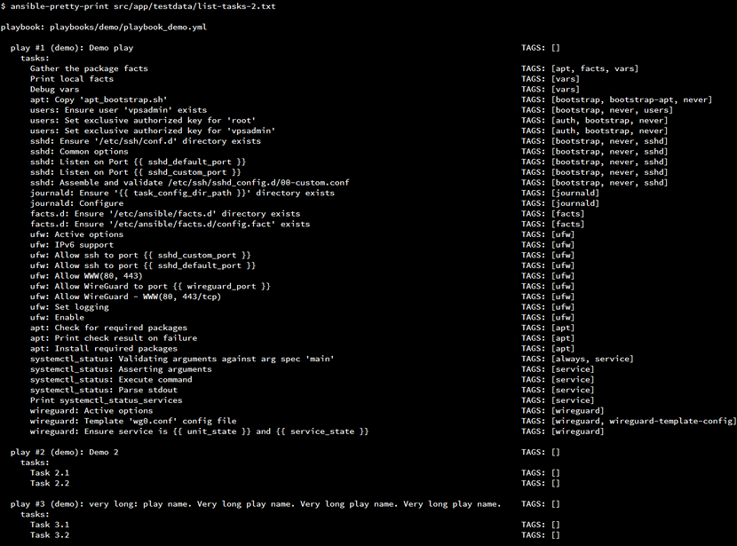
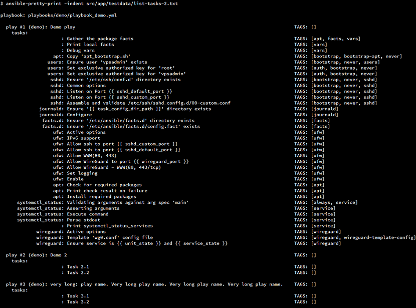
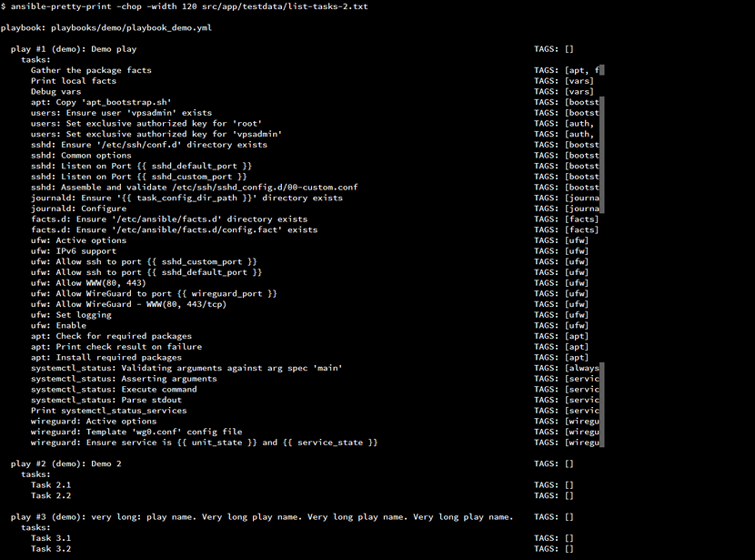
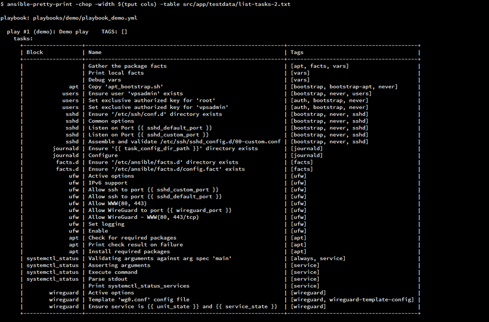
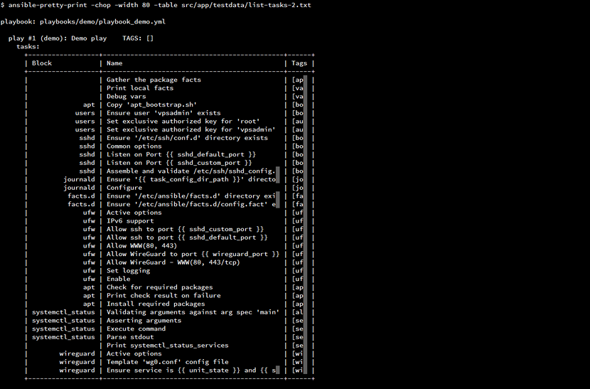
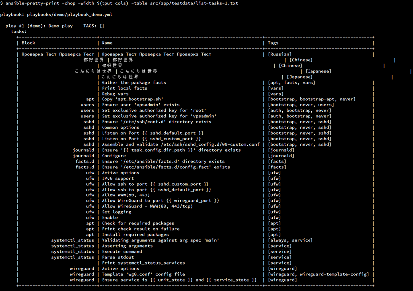
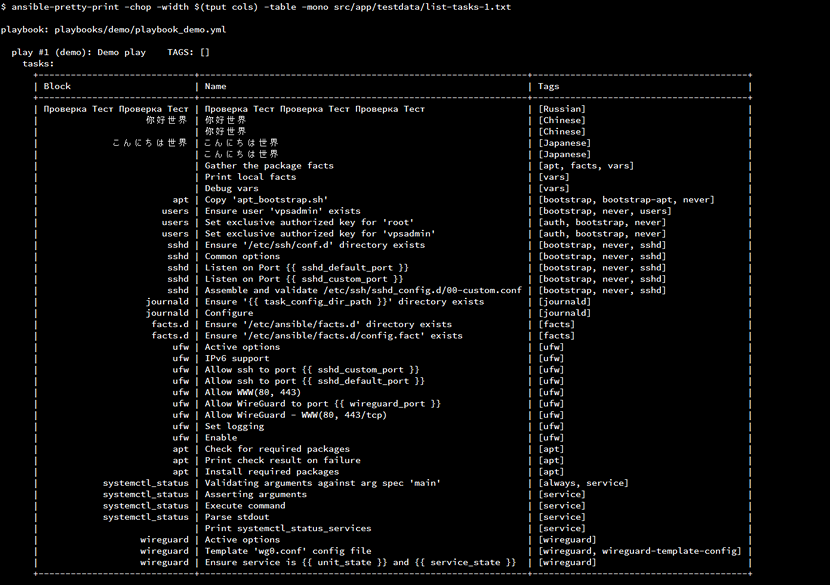

# ansible-pretty-print

[](https://pkg.go.dev/github.com/keewek/ansible-pretty-print)
[](https://goreportcard.com/report/github.com/keewek/ansible-pretty-print)

CLI tool that pretty-prints an output of `ansible-playbook --list-tasks` command.

[](https://raw.githubusercontent.com/keewek/ansible-pretty-print/main/assets/docs/table_dos.png)

## Install

`go install github.com/keewek/ansible-pretty-print@latest`

or download app executable at [Releases](https://github.com/keewek/ansible-pretty-print/releases) page

## Usage

```
Usage: ansible-pretty-print [OPTION]... [FILE]
Pretty-print Ansible's --list-tasks output

  -chop
        chop long lines
  -dos
        DOS box-drawing characters
  -indent
        indent block/role
  -mono
        calculate string width as monospace width
  -stats
        print stats
  -stdin
        read standard input
  -table
        table output
  -version
        output version information
  -width int
        custom line width
```

- File
    
    `ansible-pretty-print path/to/ansible--list-tasks-output`

- Stdin

    `ansible-playbook --list-tasks path/to/playbook -i path/to/inventory | ansible-pretty-print --stdin`

 - BASH function

    ```bash
    lt-ansible-playbook() {
        ansible-playbook --list-tasks "$@" | ansible-pretty-print --stdin --chop
    }

    ltt-ansible-playbook() {
        ansible-playbook --list-tasks "$@" | ansible-pretty-print --stdin --dos --table
    }
    ```

    **Columns output:**

    `lt-ansible-playbook --list-tasks path/to/playbook -i path/to/inventory`
    
    **Table output:**

    `ltt-ansible-playbook --list-tasks path/to/playbook -i path/to/inventory`

## Features

- Default output

    [](https://raw.githubusercontent.com/keewek/ansible-pretty-print/main/assets/docs/columns.png)

- Flag `--indent`: indent block/role

    [](https://raw.githubusercontent.com/keewek/ansible-pretty-print/main/assets/docs/columns_indent.png)

- Flag `--chop`: chop long lines

    [](https://raw.githubusercontent.com/keewek/ansible-pretty-print/main/assets/docs/columns_chop_120.png)

    > Use `--width` flag to specify custom width

- Flag `--table`: table output

    [](https://raw.githubusercontent.com/keewek/ansible-pretty-print/main/assets/docs/table.png)

    > Use `--width` flag to specify custom width

    [](https://raw.githubusercontent.com/keewek/ansible-pretty-print/main/assets/docs/table_80.png)

- Flag `--dos`: DOS box-drawing characters

    [](https://raw.githubusercontent.com/keewek/ansible-pretty-print/main/assets/docs/table_dos.png)

- Flag `--mono`: calculate string width as monospace width

    Use with East-Asian content

    [](https://raw.githubusercontent.com/keewek/ansible-pretty-print/main/assets/docs/table_EA.png)
    [](https://raw.githubusercontent.com/keewek/ansible-pretty-print/main/assets/docs/table_EA_mono.png)
